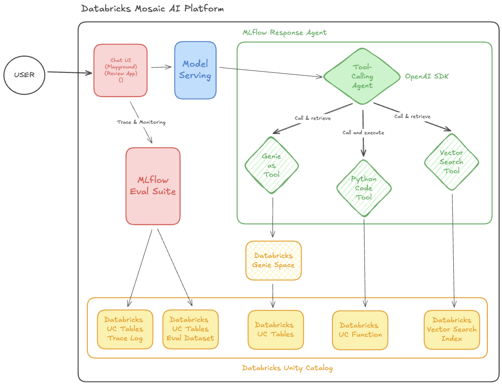

# Multi-Agent System with OpenAI Response API, Databricks Genie, and Databricks Vector Search

A comprehensive agent framework built on Databricks that combines Unity Catalog functions, Databricks Genie natural language querying, and vector search capabilities for intelligent data analysis and insights.

## Architecture

This agent system leverages the **OpenAI Responses API** format with tool-calling capabilities, providing:

- **Unity Catalog Integration**: Execute UDFs as agent tools for data processing
- **Databricks Genie Integration**: Natural language querying of data warehouses using AI/BI Genie
- **Vector Search Support**: Unstructured data retrieval capabilities
- **MLflow Tracing**: Comprehensive observability and debugging
- **Streaming Responses**: Real-time agent interactions



## Features

### 🔧 **Tool System**

- **Python Execution**: Execute Python code via `system.ai.python_exec`
- **Genie Queries**: Natural language data analysis using `query_data_with_genie`
- **Vector Search**: Semantic search over unstructured data (configurable)
- **Custom Tools**: Extensible framework for additional Unity Catalog functions

### 🧠 **AI/BI Genie Integration**

- **Natural Language Queries**: Ask questions about your data in plain English
- **SQL Generation**: Automatic SQL query generation from natural language
- **Data Insights**: Comprehensive analysis and visualization recommendations
- **DataFrame Support**: Handles both text and tabular data responses

### 📊 **MLflow Integration**

- **Automatic Tracing**: Built-in span tracking for LLM calls, tool execution, and agent workflows
- **Model Management**: Centralized model versioning and deployment
- **Experiment Tracking**: Development and debugging support

## Configuration

The agent is configured via `config.yaml`. Copy the template file and update with your settings:

```bash
cp src/config.template.yaml src/config.yaml
cp databricks.template.yml databricks.yml
```

Configuration structure (`config.yaml`):

```yaml
databricks:
  catalog: users
  schema: your_schema
  model: your_model_name
  workspace_url: https://your-workspace.databricks.net/
  sql_warehouse_id: your_warehouse_id
  mlflow_experiment_id: your_experiment_id

agent:
  name: your_agent_name
  llm:
    endpoint_name: "databricks-claude-3-7-sonnet" 
    temperature: 0.1
  system:
    prompt: |
      You are a helpful assistant that can run Python code and analyze data.
  tools:
    uc_tool_names:
      - "system.ai.python_exec"
    genie:
      space_id: your_genie_space_id
```

## Getting Started

### Prerequisites

- Databricks workspace with Unity Catalog enabled
- AI/BI Genie space configured
- Required packages installed:

  ```bash
  pip install databricks-ai-bridge databricks-openai databricks-sdk mlflow
  ```

### Setup Instructions

1. **Clone and setup configuration files**:

   ```bash
   # Copy template files to create your local configs
   cp src/config.template.yaml src/config.yaml
   cp databricks.template.yml databricks.yml
   ```

2. **Configure your environment**:
   - Update `src/config.yaml` with your Databricks settings:
     - Set your `catalog` and `schema` for Unity Catalog
     - Update `workspace_url` to your Databricks workspace
     - Configure `genie.space_id` with your AI/BI Genie space ID
     - Set `sql_warehouse_id` for your SQL warehouse
     - Update secret scope and key names for authentication
   - Update `databricks.yml` with your workspace host URL

3. **Install dependencies**:

   ```bash
   pip install -r src/requirements.txt
   ```

### Usage

1. **Run the agent**: Use `driver.ipynb` for development and testing
2. **Query your data**:

   ```python
   result = AGENT.predict({
       "input": [{
           "role": "user",
           "content": "What are our sales trends this quarter?"
       }]
   })
   ```

3. **Evaluate the agent**: The system includes comprehensive evaluation capabilities:

   ```python
   eval_results = mlflow.genai.evaluate(
       data=eval_dataset_list,
       predict_fn=lambda input: AGENT.predict({"input": input}),
       scorers=[Correctness(), RelevanceToQuery(), Safety()]
   )
   ```

## Agent Capabilities

### Data Analysis Examples

- "Show me revenue trends by region for the last 12 months"
- "Which customers have the highest lifetime value?"
- "Analyze user engagement metrics and identify improvement opportunities"
- "Compare year-over-year growth across product categories"

### Code Execution

- Execute Python scripts for data processing
- Generate visualizations and reports
- Perform statistical analysis and modeling

## Implementation Details

### Core Components

- **`MultiAgent`**: Main agent class extending MLflow's `ResponsesAgent`
- **`ToolInfo`**: Wrapper for OpenAI function calling specifications
- **Genie Integration**: Uses `databricks-ai-bridge` for simplified natural language querying
- **Streaming Support**: Real-time response generation with proper event handling

### Tool Creation Pattern

```python
def create_custom_tool(params):
    tool_spec = {
        "type": "function",
        "function": {
            "name": "tool_name",
            "description": "Tool description",
            "parameters": {...}
        }
    }

    def exec_fn(**kwargs):
        # Tool implementation
        return result

    return ToolInfo(name="tool_name", spec=tool_spec, exec_fn=exec_fn)
```

### Vector Search Architecture

The system implements intelligent document retrieval with automatic filter extraction:

- **LLM-Powered Query Parsing**: Uses the configured LLM endpoint to parse natural language queries and extract:
  - Company names and stock tickers (converted to uppercase, normalized format)
  - Years (converted to integers, supports ranges)
  - Refined search queries (with filter terms removed)

- **Dynamic Filter Construction**: Converts parsed filters to Databricks Vector Search format:

  ```python
  {"company": "APPLE", "year": [2022, 2023]}  # Multiple years as array
  {"company": ["MICROSOFT", "APPLE"]}         # Multiple companies
  ```

- **Schema-Aware Processing**: Only applies filters for fields defined in the `vs_schema` configuration

- **Query Examples**:
  - `"AAPL risks 2023"` → Search: `"risks"`, Filters: `{"company": "APPLE", "year": 2023}`
  - `"Tesla vs Ford competition 2024"` → Search: `"competition"`, Filters: `{"company": ["TESLA", "FORD"], "year": 2024}`

## Evaluation

The system includes a comprehensive evaluation framework using MLflow 3's genAI evaluation capabilities:

### Evaluation Dataset

The evaluation dataset (`src/evals/eval-questions.json`) includes test cases covering:

- **Financial Data Queries**: Testing Genie integration with structured data
- **Document Retrieval**: Testing vector search with company-specific information
- **Complex Analysis**: Multi-step reasoning and calculation tasks

### Built-in Scorers

The evaluation uses multiple MLflow scorers:

- **Correctness**: Validates factual accuracy against expected responses
- **RelevanceToQuery**: Measures response relevance to user questions
- **Safety**: Ensures responses meet safety guidelines
- **RetrievalGroundedness**: Validates answers are grounded in retrieved data
- **RetrievalRelevance**: Measures quality of document retrieval

### Running Evaluations

Execute evaluations in `driver.ipynb`:

```python
import json
import mlflow
from mlflow.genai.scorers import Correctness, RelevanceToQuery, Safety

# Load evaluation dataset
with open("./evals/eval-questions.json", "r") as f:
    eval_dataset_list = json.load(f)

# Run evaluation
eval_results = mlflow.genai.evaluate(
    data=eval_dataset_list,
    predict_fn=lambda input: AGENT.predict({"input": input}),
    scorers=[Correctness(), RelevanceToQuery(), Safety()]
)
```

Results are automatically logged to your MLflow experiment for analysis and comparison across iterations.

## Development

The agent supports hot reloading and comprehensive tracing:

- View traces in MLflow experiments for debugging
- Monitor tool execution performance
- Track conversation flows and decision points
- Compare evaluation metrics across agent versions

## Documentation Reference

- [Databricks Agent Framework](https://docs.databricks.com/aws/en/notebooks/source/generative-ai/responses-agent-fmapi.html)
- [AI/BI Genie Documentation](https://docs.databricks.com/aws/en/genie/conversation-api)
- [Databricks AI Bridge](https://api-docs.databricks.com/python/databricks-ai-bridge/latest/)
